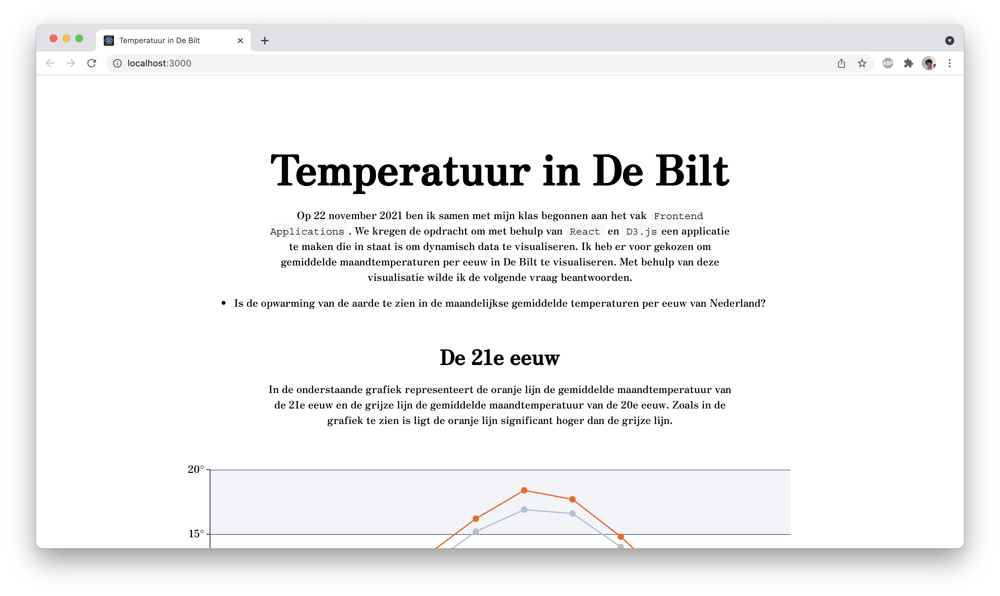

# frontend-applications

## 📋 My concept

Hi! Welcome to my repository for the two week course frontend-applications! Here you can find the website I produced during this course.

We were tasked to create a data visualization using `D3.js` and a JavaScript framework of your choice. I decided to use `React` for this exercise. I chose to visualize temperature data of the Netherlands. I was curious if I could see the effect of global warming on temperature in my own visualisations. I used the following question as the basis of my visualizations.

- Can the effects of global warming be recognised in the monthly average temperatures per century in the Netherlands?

Feel free to clone this repository or [visit]() this site and take a look!

> **NOTE:** The content on this website is completely written in Dutch!

## 🧑‍💻 How to install

> **NOTE:** Before you can install this project be sure to have both [Node.js](https://nodejs.org/en/download/) and NPM installed. NPM should automatically be installed when installing Node.js.

You can install my project locally by running the following command in your local folder.

- `git clone https://github.com/Steinberg99/functional-programming`

When you have cloned my repository run the command `npm install` to install all of the project dependencies. Run this command in the local folder where you cloned my project. When you have done this you can run the command `npm start` to start the project. The website should open automatically in the browser on `localhost:3000`.

## 💻 Technologies

During this project I made use of the following technologies or libraries.

- [Node.js](https://nodejs.org/en/download/),
- [React](https://reactjs.org/)
- [D3.js](https://d3js.org/)

## ✍️ Author and license

Author: [Stein Bergervoet](https://github.com/Steinberg99/), license: [MIT License](https://github.com/Steinberg99/functional-programming/blob/main/LICENSE).

